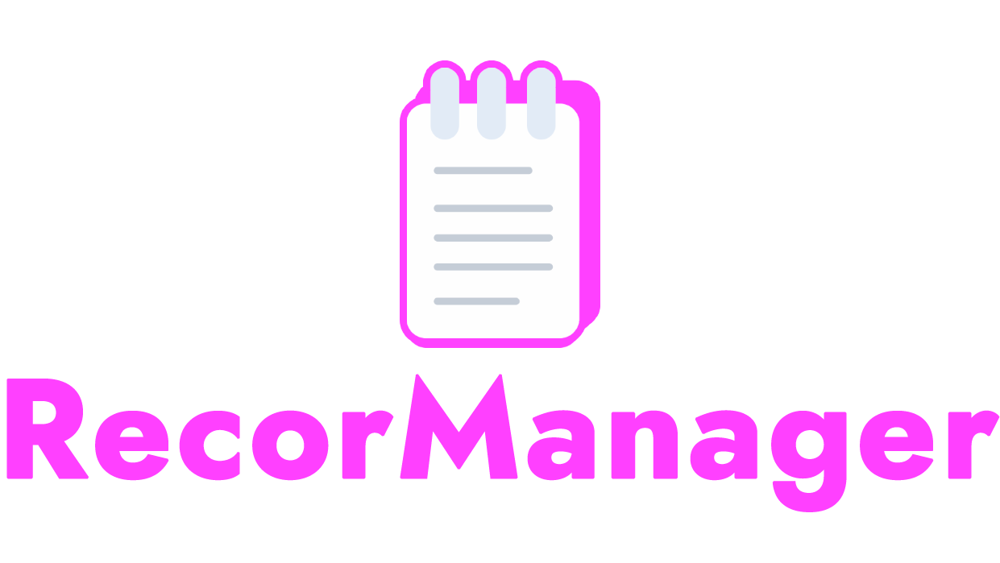
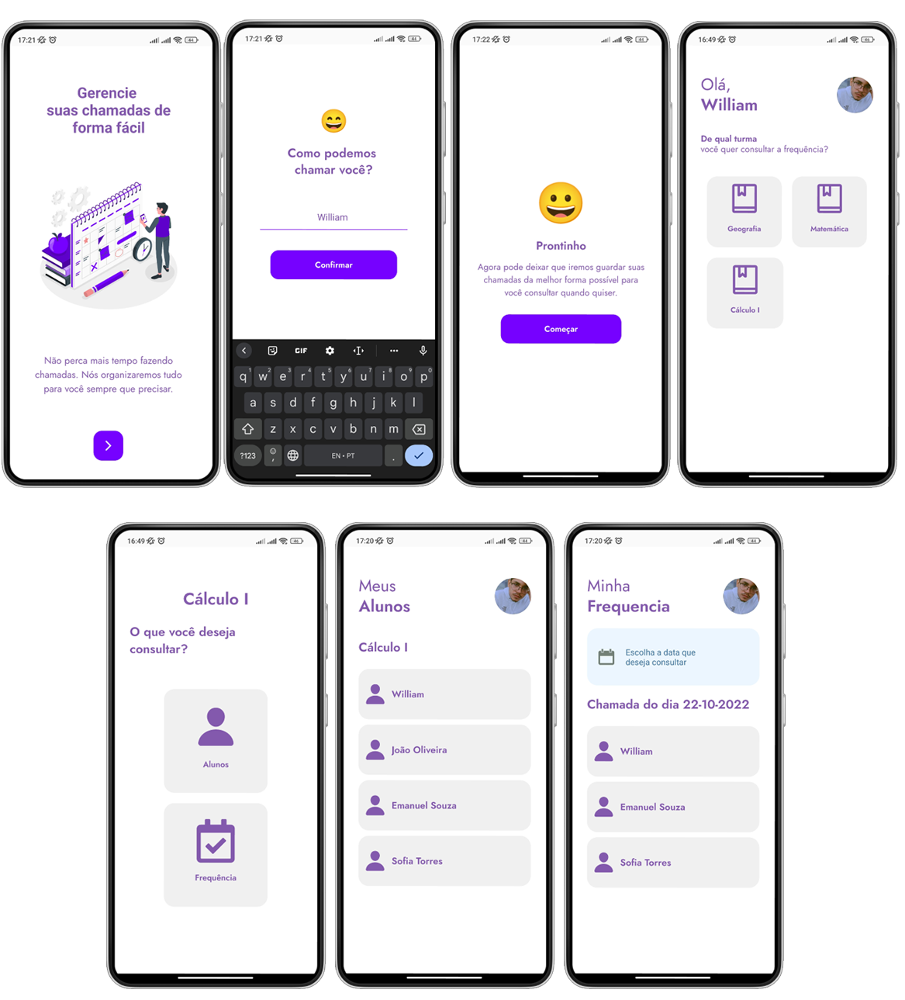
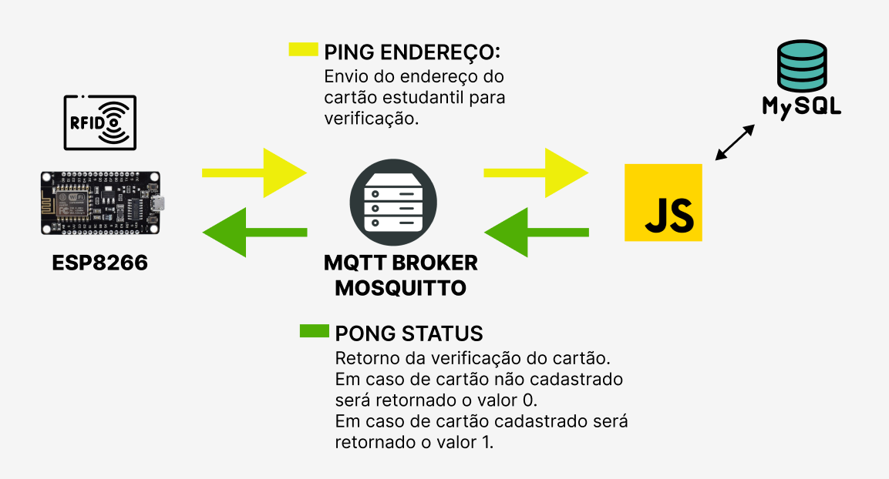

<h1 align="center">
  
  <br />
  <a href="https://www.linkedin.com/in/williamvsmartins">
    
  </a>
  <a href="https://github.com/WilliamVSMartins/Frequency_register/blob/main/LICENSE">
    
  </a>
  <a href="https://github.com/WilliamVSMartins/Frequency_register/issues?q=is%3Aissue+is%3Aclosed">
    
  </a>
  <a href="https://github.com/WilliamVSMartins/Frequency_register/network">
    
  </a>
  <a href="https://github.com/WilliamVSMartins/Frequency_register/stargazers">
    
  </a>
</h1>

<p align="center">
  <a href="#page_facing_up-descrição">Descrição</a>&nbsp;&nbsp;&nbsp;|&nbsp;&nbsp;&nbsp;
  <a href="#wrench-Materiais">Materiais utilizados</a>&nbsp;&nbsp;&nbsp;|&nbsp;&nbsp;&nbsp;
  <a href="#art-Layout">Layout</a>&nbsp;&nbsp;&nbsp;|&nbsp;&nbsp;&nbsp;
  <a href="#-tecnologias">Tecnologias</a>&nbsp;&nbsp;&nbsp;|&nbsp;&nbsp;&nbsp;
  <a href="#clipboard-Funcionalidades">Funcionalidades</a>&nbsp;&nbsp;&nbsp;|&nbsp;&nbsp;&nbsp;
  <a href="#left_right_arrow-Fluxo">Fluxo do projeto</a>&nbsp;&nbsp;&nbsp;|&nbsp;&nbsp;&nbsp;
  <a href="#man-Autor">Autor</a>&nbsp;&nbsp;&nbsp;|&nbsp;&nbsp;&nbsp;
  <a href="#memo-Licença">Licença</a>
</p>

## :page_facing_up: Descrição
O Recor Manager é um sistema feito para facilitar o registro da frequência de alunos em sala. Observando o tempo perdido com chamadas feitas ao início da aula, tempo esse que poderia ser melhor aproveitado pelo professor, pensei em uma solução para que esse registro fosse feito eletronicamente onde o professor possa receber a frequência de forma online.

Para isso, o professor passaria a utilizar um simples sistema onde a frequência de seus alunos são registradas de forma rápida e eficiente.

## :wrench: Materiais

- ESP8266
- RFID: Rfid Mfrc522 Mifare
- Display LCD
- Buzzer

## :art: Layout


## 🛠 Tecnologias
Este projeto foi desenvolvido com as seguintes tecnologias

#### App Android / IOS
- [React Native](https://reactnative.dev/)
- [Expo](https://expo.io/)
- [TypeScript](https://www.typescriptlang.org/)
- [Lottie React Native](https://docs.expo.io/versions/latest/sdk/lottie/)
- [Axios](https://axios-http.com/ptbr/docs/intro)

#### Front-end
- [React](https://reactjs.org/)
- [Axios](https://axios-http.com/ptbr/docs/intro)

#### Back-end Nodejs
- [mqttjs](https://github.com/mqttjs/MQTT.js);
- [promise](https://github.com/then/promise);
- [request-promise](https://github.com/request/request-promise);
- [express](https://github.com/expressjs/express);
- [mysqljs](https://github.com/mysqljs/mysql);
- [dotenv](https://github.com/motdotla/dotenv);

#### Firmware ESP8266
- [RFID](https://github.com/miguelbalboa/rfid/);
- [PubSubclient](https://github.com/knolleary/pubsubclient);
- [LiquidCrystal_I2C](https://github.com/fdebrabander/Arduino-LiquidCrystal-I2C-library)

## :clipboard: Funcionalidades
#### App Android / IOS
- [x] Fazer autenticação com o nome.
- [x] Visualizar turmas e alunos.
- [x] Fazer consulta de frequência por data e turma específica.

#### Front-end
- [x] Criar novas novas turmas e adicionar novos alunos
- [x] Visualizar turmas e alunos.
- [x] Fazer consulta de frequência por data e turma específica.

#### Firmware ESP8266
- [x] Faz a leitura das tags RFID, trata o valor e envia via protocolo MQTT.
- [x] Mostra mensagem de confirmação/erro que retornam do back-end no Display.
- [x] Emite som de confirmaçâo/erro.
- [x] Conecta no WI-Fi.

#### Back-end Nodejs
- [x] Recebe dados da placa ESP8266 através do protocolo MQTT.
- [x] Processa e insere os dados no banco MYSQL.
- [x] Salva data do registro da frequência.

## :left_right_arrow: Fluxo
<div align="center">

</div>

No diagrama acima, pode-se observar qual será o fluxo da aplicação que foi desenvolvida. Parece complicado, mas quando você começa entender como se da a comunicação de redes, você tira de letra uma arquitetura dessas.

Basicamente temos 2 fluxos neste projeto - o ping e o pong. Ambos serão abordados abaixo.

O fluxo referente ao PING(indicado com a cor amarela) é p fluxo inicial da comunicação. É a partir dele que toda a comunição começará. Então, as seguintes etapas serão feitas:

- 1º - Leitura do ID da tag RFID;

- 2º - Preparação da (payload) mensagem para envio;

- 3º - Envio da payload através do protocolo MQTT;

- 4º - O servidor back-end estará na escuta do tópico referente;

- 5º - Recebida a payload(que será o ID da tag), será efetuada uma consulta no banco de dados;

- 6º - Depois da tag ser consultada, será feito uma verificação(condicional) se a mesma está ativada ou desativada;

Logo em seguida, o tópico PONG (indicado com a cor verde), que é responsável pelo retorno, entra em ação, ou seja, se a presença do aluno foi registrada ou simplesmente está sem cadastro. O resultado será um valor booleano (0 ou 1).

## :man: Autor

<a href="https://github.com/WilliamVSMartins/">
 
 <br />
 <sub><b>William Martins</b></sub>
</a>


Entre em contato!🚀

<a href="https://www.linkedin.com/in/williamvsmartins">
  
</a>


## :memo: Licença
Copyright © 2022 [William Martins](https://github.com/WilliamVSMartins).<br />

Distributed under the **MIT License**.
``` 
MIT License

Copyright (c) 2022 William Martins

Permission is hereby granted, free of charge, to any person obtaining a copy
of this software and associated documentation files (the "Software"), to deal
in the Software without restriction, including without limitation the rights
to use, copy, modify, merge, publish, distribute, sublicense, and/or sell
copies of the Software, and to permit persons to whom the Software is
furnished to do so, subject to the following conditions:

The above copyright notice and this permission notice shall be included in all
copies or substantial portions of the Software.

THE SOFTWARE IS PROVIDED "AS IS", WITHOUT WARRANTY OF ANY KIND, EXPRESS OR
IMPLIED, INCLUDING BUT NOT LIMITED TO THE WARRANTIES OF MERCHANTABILITY,
FITNESS FOR A PARTICULAR PURPOSE AND NONINFRINGEMENT. IN NO EVENT SHALL THE
AUTHORS OR COPYRIGHT HOLDERS BE LIABLE FOR ANY CLAIM, DAMAGES OR OTHER
LIABILITY, WHETHER IN AN ACTION OF CONTRACT, TORT OR OTHERWISE, ARISING FROM,
OUT OF OR IN CONNECTION WITH THE SOFTWARE OR THE USE OR OTHER DEALINGS IN THE
SOFTWARE.
```
